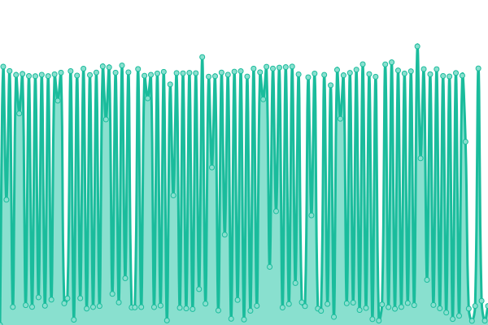
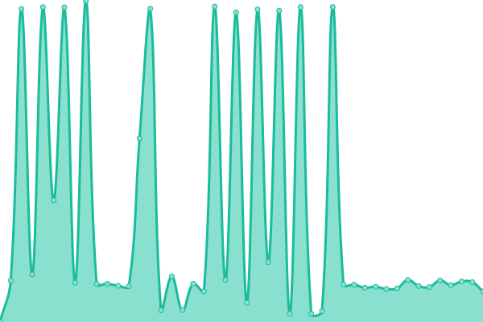

# [📈 Live Status](https://status.substrate.geometry.io): <!--live status--> **🟧 Partial outage**

This repository contains the open-source uptime monitor and status page for [Geometry Labs](https://status.substrate.geometry.io), powered by [Upptime](https://github.com/upptime/upptime).

With [Upptime](https://upptime.js.org), you can get your own unlimited and free uptime monitor and status page, powered entirely by a GitHub repository. We use [Issues](https://github.com/geometry-labs/substrate-status-page/issues) as incident reports, [Actions](https://github.com/geometry-labs/substrate-status-page/actions) as uptime monitors, and [Pages](https://status.substrate.geometry.io) for the status page.

<!--start: status pages-->
<!-- This summary is generated by Upptime (https://github.com/upptime/upptime) -->
<!-- Do not edit this manually, your changes will be overwritten -->
<!-- prettier-ignore -->
| URL | Status | History | Response Time | Uptime |
| --- | ------ | ------- | ------------- | ------ |
|  [Global Polkadot RPC Endpoints](https://polkadot.geometry.io/api) | 🟥 Down | [global-polkadot-rpc-endpoints.yml](https://github.com/geometry-labs/substrate-status-page/commits/HEAD/history/global-polkadot-rpc-endpoints.yml) | 

 512ms
     
 | 

<a href="https://status.substrate.geometry.io/history/global-polkadot-rpc-endpoints">60.62%</a>
    

|  [Global Kusama RPC Endpoints](https://kusama.geometry.io/api) | 🟩 Up | [global-kusama-rpc-endpoints.yml](https://github.com/geometry-labs/substrate-status-page/commits/HEAD/history/global-kusama-rpc-endpoints.yml) | 

 286ms
     
 | 

<a href="https://status.substrate.geometry.io/history/global-kusama-rpc-endpoints">89.13%</a>
    

|  [US WEST Polkadot RPC Endpoints](https://polkadot-us-west-2.geometry.io/api) | 🟥 Down | [us-west-polkadot-rpc-endpoints.yml](https://github.com/geometry-labs/substrate-status-page/commits/HEAD/history/us-west-polkadot-rpc-endpoints.yml) | 

 748ms
     
 | 

<a href="https://status.substrate.geometry.io/history/us-west-polkadot-rpc-endpoints">9.47%</a>
    

|  [US WEST Kusama RPC Endpoints](https://kusama-us-west-2.geometry.io/api) | 🟩 Up | [us-west-kusama-rpc-endpoints.yml](https://github.com/geometry-labs/substrate-status-page/commits/HEAD/history/us-west-kusama-rpc-endpoints.yml) | 

 715ms
     
 | 

<a href="https://status.substrate.geometry.io/history/us-west-kusama-rpc-endpoints">99.37%</a>
    

|  [EU WEST Polkadot RPC Endpoints](https://polkadot-eu-west-1.geometry.io/api) | 🟩 Up | [eu-west-polkadot-rpc-endpoints.yml](https://github.com/geometry-labs/substrate-status-page/commits/HEAD/history/eu-west-polkadot-rpc-endpoints.yml) | 

 1199ms
     
 | 

<a href="https://status.substrate.geometry.io/history/eu-west-polkadot-rpc-endpoints">91.47%</a>
    

|  [EU WEST Kusama RPC Endpoints](https://kusama-eu-west-1.geometry.io/api) | 🟩 Up | [eu-west-kusama-rpc-endpoints.yml](https://github.com/geometry-labs/substrate-status-page/commits/HEAD/history/eu-west-kusama-rpc-endpoints.yml) | 

 760ms
     
 | 

<a href="https://status.substrate.geometry.io/history/eu-west-kusama-rpc-endpoints">95.38%</a>
    

<!--end: status pages-->

[**Visit our status website →**](https://status.substrate.geometry.io)

## 📄 License

- Powered by: [Upptime](https://github.com/upptime/upptime)
- Code: [MIT](./LICENSE) © [Geometry Labs](https://status.substrate.geometry.io)
- Data in the `./history` directory: [Open Database License](https://opendatacommons.org/licenses/odbl/1-0/)
